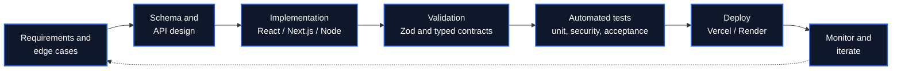
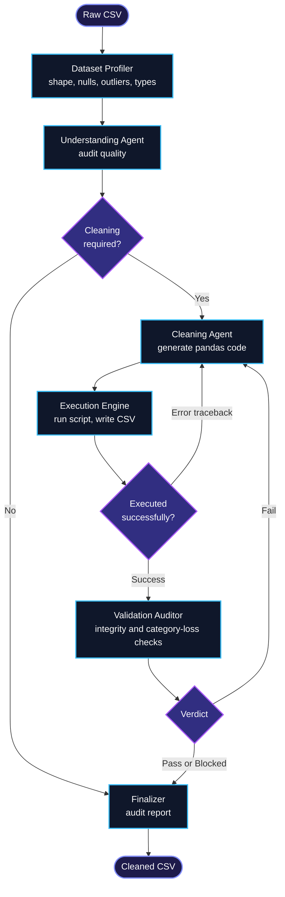

<!-- HEADER -->

  

  

 

## Quick Navigation

---

## About

Full-Stack Developer who builds scalable web applications with **React, Node.js, Next.js, Express, MongoDB, PostgreSQL and TypeScript**, and designs **agentic AI systems** with **LangChain and LangGraph**.

My work sits where solid backend engineering meets applied AI: secure REST APIs, authentication and authorization, moderation and validation pipelines, and multi-agent workflows that check and correct their own output. A strong Data Structures and Algorithms foundation keeps the code efficient and maintainable.

<table>
  <tr>
    <td align="center" width="20%"><h3>6</h3>Projects across web and agentic AI</td>
    <td align="center" width="20%"><h3>400+</h3>LeetCode problems solved</td>
    <td align="center" width="20%"><h3>150+</h3>Advanced DSA problems in training</td>
    <td align="center" width="20%"><h3>73</h3>Test cases in one rule-engine suite</td>
    <td align="center" width="20%"><h3>1st</h3>Smart India Hackathon 2025, internal round</td>
  </tr>
</table>

---

## Focus Areas

<table>
  <tr>
    <td width="33%" valign="top">
      <h4>Full-Stack Web Development</h4>
      MERN and Next.js applications with typed APIs, role-based access control, schema validation and production deployments.
    </td>
    <td width="33%" valign="top">
      <h4>Agentic and Generative AI</h4>
      LangChain and LangGraph pipelines with routing, tool execution and self-healing feedback loops, backed by LLM APIs.
    </td>
    <td width="33%" valign="top">
      <h4>Secure and Reliable Systems</h4>
      Argon2id hashing, hashed sessions, rate limiting, CSRF checks and automated test suites for security and acceptance scenarios.
    </td>
  </tr>
</table>

---

## Tech Stack

<table>
  <tr>
    <td width="190"><b>Languages</b></td>
    <td>
      
    </td>
  </tr>
  <tr>
    <td><b>Frontend</b></td>
    <td>
      
      
    </td>
  </tr>
  <tr>
    <td><b>Backend</b></td>
    <td>
      
      
      
      
    </td>
  </tr>
  <tr>
    <td><b>Generative and Agentic AI</b></td>
    <td>
      
      
      
      
      
    </td>
  </tr>
  <tr>
    <td><b>Data and Machine Learning</b></td>
    <td>
      
      
    </td>
  </tr>
  <tr>
    <td><b>Databases and Cloud</b></td>
    <td>
      
      
      
      
    </td>
  </tr>
  <tr>
    <td><b>Testing and Tools</b></td>
    <td>
      
      
    </td>
  </tr>
</table>

---

## Featured Projects

### Agentic and Generative AI

<table>
  <tr>
    <td width="50%" valign="top">
      <h3>AutoClean AI</h3>
      Autonomous Multi-Agent Data Cleaning Pipeline
      
A LangGraph pipeline that profiles a CSV, decides whether cleaning is needed, generates pandas code, executes it, and audits the result. A validation agent can fail the output and send it back for correction, creating a self-healing loop. Ships with a Streamlit interface that shows each agent step and a before-and-after comparison.

      <ul>
        <li>Six-stage graph: profiler, understanding agent, cleaning agent, execution engine, validation auditor, finalizer</li>
        <li>Conservative cleaning policy that never drops valid categories or rows without justification</li>
        <li>Downloadable cleaned CSV, generated script and audit report</li>
      </ul>
      
      
      
      
        
      
    </td>
    <td width="50%" valign="top">
      <h3>Nova-Learn</h3>
      Self-Study Learning Platform | Dec 2025 - Feb 2026
      
A MERN learning platform with scalable REST APIs and a responsive React and Bootstrap interface. LLM APIs power an ML and NLP based recommendation feature that personalizes the study experience.

      <ul>
        <li>Scalable REST API layer</li>
        <li>Gemini API integration for personalized recommendations</li>
        <li>Responsive, component-driven UI</li>
      </ul>
      
        
      
    </td>
  </tr>
</table>

### Full-Stack Web Applications

<table>
  <tr>
    <td width="50%" valign="top">
      <h3>CCP Studio: Confidential Communication Portal</h3>
      Secure pseudonymous client-contractor collaboration
      
A portal that keeps identities private through project-scoped aliases and intercepts unauthorized contact exchanges before a message is delivered. Administrators review held messages through an idempotent decision queue.

      <ul>
        <li>Moderation engine with Unicode normalisation and obfuscation detection across four policy categories</li>
        <li>Argon2id hashing, SHA-256 hashed sessions, rate limiting, strict CSP and CSRF origin validation</li>
        <li>Anti-enumeration responses plus 73 rule-engine tests and a dedicated IDOR audit suite</li>
      </ul>
      
      
        
      
      
    </td>
    <td width="50%" valign="top">
      <h3>BlinkIn</h3>
      E-Commerce Web Application | Sept - Oct 2025
      
A full-stack store with REST APIs for products, users and orders, secured with JWT authentication and role-based authorization, with Cloudinary handling media uploads.

      <ul>
        <li>Product, user and order management APIs</li>
        <li>JWT authentication with role-based access control</li>
        <li>Cloudinary media pipeline</li>
      </ul>
      
      
        
      
    </td>
  </tr>
  <tr>
    <td width="50%" valign="top">
      <h3>Potify</h3>
      Music Streaming Web Application | Mar - Apr 2025
      
A responsive React application with a dynamic UI, asynchronous REST data handling and emotion-based recommendation logic for personalized music suggestions.

      
        
      
    </td>
    <td width="50%" valign="top">
      <h3>Honey Bee Testing</h3>
      Web Development Project
      
A web application project built as part of my full-stack work. Replace this line with a one-sentence summary of what it does and the main feature you are proudest of.

      
        
      
    </td>
  </tr>
</table>

---

## Engineering Workflow

### How I ship software

### How my agentic pipelines work (AutoClean AI)

---

## Experience

<table>
  <tr>
    <td valign="top">
      <b>Advanced Data Structures and Algorithms Training</b> 
      Geeta University x Coding Blocks | June 2025 - August 2025
      <ul>
        <li>Solved 150+ advanced DSA problems across Dynamic Programming, Trees and Graphs.</li>
        <li>Optimized solutions for improved time and space complexity across diverse problem sets.</li>
        <li>Participated in peer code reviews to improve implementation quality and coding practices.</li>
      </ul>
    </td>
  </tr>
</table>

---

## Achievements and Certifications

| | |
| :--- | :--- |
| **Smart India Hackathon 2025** | 1st place, internal round |
| **National-Level Hackathons** | Shortlisted in 3 events |
| **LeetCode** | 400+ problems solved |
| **Design Thinking** | NPTEL Spring School on Sports Technology, ML and Data Analytics, IIT Delhi (2026) |

---

## GitHub and LeetCode Stats

 

---

## Contact

I am open to internships, full-time roles and collaboration on full-stack and agentic AI products.

